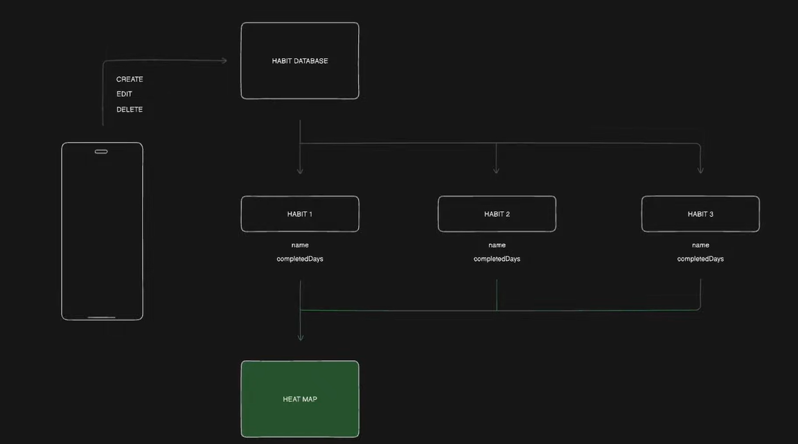

# HabitForge

HabitForge is a minimalist habit tracker designed to help you build and track your daily routines effortlessly. With its simple interface and powerful features, HabitForge empowers you to cultivate positive habits and achieve your goals effectively.

System Flow

## Features

- **Minimalist Design**: Streamlined interface focused on simplicity and ease of use.
- **Customizable Habit Tracking**: Create and track your own habits tailored to your specific goals and needs.
- **Progress Tracking**: Visualize your progress over time with intuitive graphs and statistics.
- **Heat Map**

## Technologies Used

- **Flutter**: UI framework for building cross-platform applications.
- **Isar**: Lightweight and fast NoSQL database for Flutter applications.
